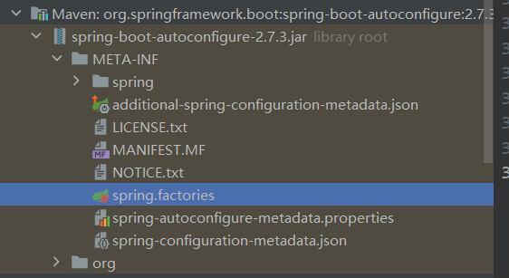

**主程序**
```java
//@SpringBootApplication:标注这个类是一个springboot的应用
@SpringBootApplication
public class Springboot01HelloworldApplication {
    public static void main(String[] args) {
//        将springboot应用启动
        SpringApplication.run(Springboot01HelloworldApplication.class, args);
    }
}
```
* 注解
```java
@springBootConfiguration //springboot的配置
    @Configuration //spring配置类
    @Component //说明这也是一个spring的组件 
        
@EnableAutoConfiguration //自动配置
    @AutoConfigurationPackage //自动配置包
        @Import(AutoConfigurationPackages.Registrar.class) //自动配置'包注册'
    @Import(AutoConfigurationImportSelector.class) //自动配置导入选择
        
//获取所有的配置
List<String> configurations = getCandidateConfigurations(annotationMetadata, attributes);
```
获取候选的配置
```java
protected List<String> getCandidateConfigurations(AnnotationMetadata metadata,AnnotationAttributes attributes){
    List<String> configurations=new ArrayList<>(
            SpringFactoriesLoader.loadFactoryNames(getSpringFactoriesLoaderFactoryClass(),getBeanClassLoader()));
    ImportCandidates.load(AutoConfiguration.class,getBeanClassLoader()).forEach(configurations::add);
    Assert.notEmpty(configurations,"No auto configuration classes found in META-INF/spring.factories nor in META-INF/spring/org.springframework.boot.autoconfigure.AutoConfiguration.imports. If you "
            +"are using a custom packaging, make sure that file is correct.");
    return configurations;
}
```
META-INF/spring.factories:自动配置的核心文件


```java
Properties properties = PropertiesLoaderUtils.loadProperties(resource);
所有的资源加载到配置类中
```
结论:springboot所有自动配置都是在启动的时候扫描并加载:spring.factories所有的自动配置类都在这里面,但是不一定生效,要判断条件是否成立,只要导入了对应的start,就有对应的启动器了,有了启动器,我们自动装配就会生效,然后就配置成功!

1. springboot在启动的时候,从类路径下／META-INF／spring．factories 获取指定的值; 
2. 将这些自动配置的类导入容器,自动配置就会生效,帮我进行自动配置!
3. 以前我们需要自动配置的东西,现在springboot帮我们做了!
4. 整合javaEE,解决方案和自动配置的东西都在 spring-boot-autoconfigure-2.2.0.RELEASE.jar这个包下 
5. 它会把所有需要导入的组件,以类名的方式返回,这些组件就会被添加到容器;
6. 容器中也会存在非常多的xxxAutoConfiguration的文件(@Bean),就是这些类给容器中导入了这个场景需要的所有组件;并自动配置,@Configuration,JavaConfig!
7. 有了自动配置类,免去了我们手动编写配置文件的工作!